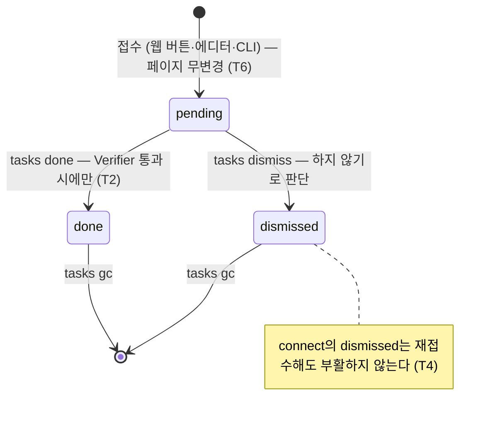

# 에이전트 태스크 큐 설계 — 위임은 파일로, 완료는 검증으로

> 상태: 구현 (2026-08-02). 불변식: [invariants.md](invariants.md) **T 섹션**.
> 원칙: 판단은 LLM이, 불변식은 코드가 ([philosophy.md](philosophy.md) 원칙 6·9).

## 1. 문제

웹 UI는 판단이 필요한 작업을 **제안**할 수 있지만 **수행**할 수 없다. '연결 제안'
(suggest.go)이 대표다 — 제안 chip은 있는데 수행 주체가 없다. 수행 주체는 이미
정해져 있다: 스킬을 가진 외부 에이전트(Claude Code, hermes, …)다. canopy는 LLM을
직접 호출하지 않는다(원칙 6). 빠진 것은 **웹 → 에이전트로 작업을 넘기는 배선**뿐이다.

[web-ui-write-design.md](web-ui-write-design.md)의 "직접 저장 대신 LLM 위임 경로"
아이스박스, [reconcile-design.md](reconcile-design.md) §6의 "웹 문을 제안 경로로
전환"이 모두 이 배선을 가리킨다. 태스크 큐가 그 구현이다.

## 2. 설계

### 큐는 위키와 함께 여행하는 파일이다

`_meta/tasks/<id>.json` — **태스크당 파일 하나**, self-versioned (AGENTS.md 규칙 1b).

- 파일 단위라서 서로 다른 태스크의 완료가 기기 간에 절대 git 충돌하지 않는다.
- git으로 여행하므로 어떤 머신의 어떤 에이전트든 같은 큐를 본다. 별도 서버·게이트웨이
  연동 없음 — hermes든 Claude Code cron이든 **loop 절차만 같으면 소비자가 된다**.
- `version` 필드로 형식이 진화한다. 닫기(close)는 raw JSON을 패치해서 쓰므로
  이 바이너리가 모르는 필드도 살아남는다(혼합 버전 안전).

```json
{
  "version": 1,
  "id": "connect-a--b",
  "type": "connect",
  "status": "pending",
  "door": "web",
  "created": "2026-08-02T10:00:00+09:00",
  "pages": ["a", "b"],
  "sim": 0.83
}
```

### 라이프사이클: `pending → done | dismissed`



- **pending**: 문(웹 버튼, CLI)이 접수만 한다. **접수는 페이지를 수정하지 않는다**(T6)
  — 수행은 판단 이후의 일이고, 판단은 에이전트의 몫이다.
- **done**: 수행 완료. 단, **done은 에이전트의 주장이 아니라 코드의 확인이다** —
  유형별 Verifier가 결과가 실제로 위키에 있는지 검사하고, 없으면 닫기를 거부한다(T2).
- **dismissed**: 에이전트(또는 사람)가 검토 후 "하지 않는다"고 판단. bridge의
  `--dismiss`와 같은 발상 — 기각된 요청이 다음 loop에 다시 떠오르지 않게 한다.

### 유형 레지스트리 — 새 유형 추가 = payload + Verifier 한 항목

`internal/tasks`의 `verifiers` 맵이 유형별 done 검증을 든다:

| type | payload | done 검증 (코드) |
|---|---|---|
| `connect` | `pages`(2), `sim` | 두 페이지가 실존하고 **상호** `[[위키링크]]`를 가진다 |
| `edit` | `pages`(1), `request`(지시) 그리고/또는 `body`(제안 본문 전문), `base`(접수 시점 파일 sha256) | 페이지가 실존하고 내용이 접수 시점과 다르다 |

- 모르는 유형은 `list`에는 정상 표시되지만 `done`은 거부된다(T5) — 옛 canopy가
  새 canopy가 접수한 태스크를 "완료했다"고 잘못 닫는 것을 막는다. `dismiss`는
  허용된다(결과 주장이 아니라 판단 기록이므로).
- `connect`의 id는 결정론(`connect-<a>--<b>`, 정렬)이라 같은 페어 재요청이 파일을
  중복 생성하지 않는다(T4). dismissed된 페어의 재접수도 no-op — "관련 없다"는
  판단을 존중한다.

### loop 소비 절차 (스킬 canopy-wiki에 수록)

```
canopy sync                       # 다른 머신이 이미 닫은 태스크를 pending으로 착각하지 않게
canopy tasks list --json          # pending만
  각 태스크: 수행(canopy update/…) → canopy tasks done <id> --note "…"
             하지 않기로 판단     → canopy tasks dismiss <id> --note "이유"
canopy sync
```

경쟁(두 에이전트가 같은 태스크를 집음)은 잠금 대신 **수행의 멱등성**으로 흡수한다:
connect의 "상호 링크 추가"는 이미 링크가 있으면 no-op이고, done 마킹이 겹치면
내용이 같아 git이 수렴한다. 개인 위키 규모에서 lease는 과하다.

### 웹 편집 = 제안 (직접 저장 폐지, 2026-08-02)

`✎ 편집`의 저장은 **파일을 쓰지 않는다**. 제출 본문 **전문**이 edit 태스크의
`body`로 접수되고(diff가 아니라 전문 — diff 적용은 깨지기 쉽고, 에이전트가 `base`
대비 비교하면 된다), 선택 메모는 `request`로 실린다. 에이전트는 제안을 base와
비교해 콘텐츠 규칙(모순 병기, 중복 통합 등)을 지키며 `canopy update`로 반영한다.
이로써 웹은 어떤 경로로도 위키 파일을 쓰지 않는다 (invariants I2·T9) —
philosophy 원칙 9의 "샛길"이 본길 접수구로 승격된 것.

### 문(door)별 접수 UI

- 웹 페이지의 제안 chip 옆 **"연결 요청"** 버튼 → `POST /task/connect` (connect 접수).
  접수된 제안은 "요청됨"으로 표시된다.
- 웹 에디터의 저장 → `POST /edit/{slug}` (제안 본문을 실은 edit 접수, 위 절).
- 웹 페이지의 **"에이전트에게 수정 요청"** 폼 → `POST /task/edit/{slug}` (지시만
  실은 edit 접수 — 본문 제안 없이 "이렇게 고쳐줘").
- 페이지에 달린 pending 태스크는 그 페이지에 **할 일 목록**으로 보인다.
- **`/special/tasks` 화면**(내비 "할 일")이 큐 전체를 보여준다: pending(루프 처리
  순서)과 최근 처리분, 제안 본문 열람. pending **edit**은 여기서 철회(dismiss)
  가능 — 요청자가 마음을 바꾸는 것도 판단이다. connect는 웹에서 철회 불가:
  기각은 페어 버튼을 영구 억제하므로(T4) 에이전트 판단으로 남긴다 (T10).
- CLI: `canopy tasks add connect <a> <b>` / `canopy tasks add edit <page> --request "…"`.

### 알림은 옵션, 큐가 진실

에이전트를 즉시 깨우고 싶으면 serve에 훅(webhook/명령)을 다는 것은 **추가 옵션**이고
이 설계의 일부가 아니다. 훅이 없어도(또는 죽어도) 큐는 남고 다음 loop가 줍는다 —
우아한 강등. 홈 화면 bridge 카드에 접수 버튼을 다는 것도 같은 이유로 후속 과제.

## 3. 명령 표면

```
canopy tasks [list] [--all | --status s] [--page slug] --json
canopy tasks add connect <a> <b>
canopy tasks add edit <page> --request "…"
canopy tasks done <id> [--note "…"]      # Verifier 통과 시에만 닫힘
canopy tasks dismiss <id> [--note "이유"]
canopy tasks gc [--days 90]              # 닫힌 지 오래된 태스크 정리 (pending은 불가침)
```

`canopy status`와 배너가 pending 수를 노출한다(원칙 5: 상태는 숨지 않는다).

## 4. 하지 않은 것

- **canopy가 태스크를 직접 수행하는 것** — 연결 하나도 "어느 문장에, 어떤 말로"는
  판단이다. 코드는 접수와 검증만 한다(원칙 6).
- **에이전트/LLM 내장, 특정 게이트웨이 연동** — 큐 파일이 인터페이스다. 소비자는
  스킬을 읽는 모든 에이전트.
- **lease/잠금** — 위 경쟁 절 참조.
