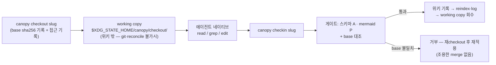

# 체크아웃 편집 — 에이전트 편집의 합법 경로 재설계

> 2026-08 설계 기록. 불변식: [invariants.md](invariants.md) **R** 섹션.

## 1. 문제 — 지시문은 affordance를 이기지 못한다

canopy-wiki 스킬은 "모든 조작은 canopy CLI로"를 요구했지만, 실제 코딩 에이전트
(pi-coding-agent 등)는 위키 파일을 자기 네이티브 도구(read 줄범위, grep -n,
문자열 치환 edit)로 직접 열어 수술적으로 편집하는 모습을 보였다. 원인은 불복종이
아니라 **능력 격차**다:

| 에이전트의 자연 동사 | 당시 canopy의 대응물 |
|---|---|
| read 파일 306-340행 | `show` — 전체 페이지 덤프뿐 |
| grep -n "## 7" | 없음 (`search`는 페이지 단위) |
| edit (old→new 치환) | `update --body-file` — 본문 전체 교체뿐 |

게다가 스킬 스스로 "직접 고쳤다면 마지막에 `canopy update`"라며 직접 편집을
축복하고 있었다. 지시문을 늘리는 것은 임시방편이다 — 에이전트는 훈련 수준에서
자기 도구에 최적화되어 있고, CLI가 그 UX(diff 표시, 유일 매치 강제, 재시도)를
따라잡는 것은 지는 싸움이다.

## 2. 해법 — 읽기는 동사 패리티, 쓰기는 체크아웃

두 층위가 다르다:

- **읽기·탐색**: 물질화가 과하다. `canopy grep`(slug+줄번호), `show --lines/--section`
  으로 동사 패리티를 이룬다. 경로 대신 slug, 전체 파일 대신 필요한 범위 — 에이전트의
  효율 함수에서도 canopy가 이긴다.
- **쓰기**: CLI가 편집기를 이기려 하지 않는다. **에이전트가 제일 잘하는 도구에
  파일을 빌려준다**:

## 3. 이 모델이 구조적으로 이기는 이유

1. **깨끗한 강제 경계**: in-place 편집이 합법인 한 위키 트리에 쓰기 거부(deny)를
   걸 수 없다. working copy가 위키 밖에 있으면 위키는 에이전트에게 읽기 전용이
   될 수 있고, 하네스 deny 규칙이 경계 하나로 정리된다 (후속 단계).
2. **게이트가 진실에 닿기 전에 발동**: 스키마(A)·mermaid(P) 검증을 통과해야만
   위키에 기록된다. 편집 중간 상태가 sync에 쓸려가거나 reconcile 오탐되는 일이 없다.
3. **동시성 감지**: checkout이 base sha256을 기록(태스크 T9의 `base`와 같은 개념),
   checkin이 대조한다. 다른 머신의 sync·웹 편집 반영과 충돌하면 **거부** — 자동
   3-way merge는 하지 않는다(모순을 조용히 덮지 않는 기존 철학). 판단은 에이전트가.
4. **rm 마찰 제거**: checkin·discard가 사본을 회수한다. 에이전트가 rm 권한 프롬프트를
   만날 일이 없고, canopy가 만든 파일은 canopy가 지우는 대칭 라이프사이클이라
   잔류물이 쌓이지 않는다.
5. **frontmatter 편집의 첫 합법 경로**: 전체 파일이 물질화되므로 tags·title 수정이
   가능해졌다 — checkin이 taxonomy(A5)로 검증하면서. (type·created 변경은 거부:
   type은 디렉토리 이동이 필요하므로 `canopy mv`가 유일 경로, created는 역사.)

## 4. 알려진 퇴행과 완화

**checkin을 잊으면 편집이 위키 밖에 고립된다** — 잊힌 `update`는 그래도 변경이
위키 안에 있어 reconcile이 보지만, 잊힌 checkout은 시야 밖이다. 완화는 기존
배너 패턴 재사용: 모든 명령 시작 시 `✎ 열린 checkout N건`, `canopy status`에
목록(R6). 사본 자동 삭제는 없다 — 수정된 사본을 조용히 지우는 코드는 두지 않는다.

## 5. 기각한 대안

- **`canopy edit --old/--new` 치환 동사**: old/new를 임시 파일에 먼저 써야 해서
  네이티브 Edit 한 번보다 단계가 많다. 편집 UX 경쟁은 구조적으로 진다.
- **자동 merge**: base 충돌 시 3-way merge는 조용한 덮어쓰기의 변종이다. 거부가 옳다.
- **락**: git 분산 위키에서 진짜 락은 틀린 도구다. 정합성은 base 해시가 담당하고,
  열린 checkout은 락이 아니라 **가시성**(배너·status)이다.
- **MCP 서버**: typed tool 표면은 장기 옵션으로 유효하나, CLI는 cron·hermes까지
  어디서나 동작한다. 먼저 CLI로 검증하고 필요해지면 얹는다.

## 6. 기존 질서와의 접점

| 기존 질서 | 접점 |
|---|---|
| `update --body-file` | 존치 — 전체 교체·스크립트·태스크 흐름용. checkin은 수술적 편집용 |
| attention (H) | checkout은 기존 `show` kind + meta `"checkout"`로 기록 (어휘 동결 존중, H6·H7 그대로 적용) |
| events (N6) | checkin은 이벤트를 남기지 않는다 — 쓰기의 진실은 JSONL 로그·git |
| reconcile (K) | working copy는 위키 밖이므로 후보로 뜨지 않는다. checkin 결과는 writeops 경유라 자동 bless |
| tasks (T9) | base sha256 대조는 웹 편집 제안의 `base`와 같은 개념 — 한 위키에 같은 규율 |
| 검색 갭 (H5) | `canopy grep`은 검색이다 — 읽음 기록 없음 (H11) |
| 마이그레이션 (J) | 신규 state 디렉토리 생성뿐, 기존 상태 이행 없음 — 사다리 rung 불필요 |

## 7. 후속 단계 (이 설계에 포함되지 않음)

- `canopy raw add` — ingest 첨부의 합법 경로 (deny 층의 전제)
- 하네스 deny 규칙을 `skills install`이 관리 (지원 하네스 한정; 미지원은 본 설계의
  affordance 층이 무게를 짊어지고 reconcile이 그물)
- 뒷길률 계기판 — canopy 경유 쓰기 대 reconcile 유입 비율을 digest/status에 노출
