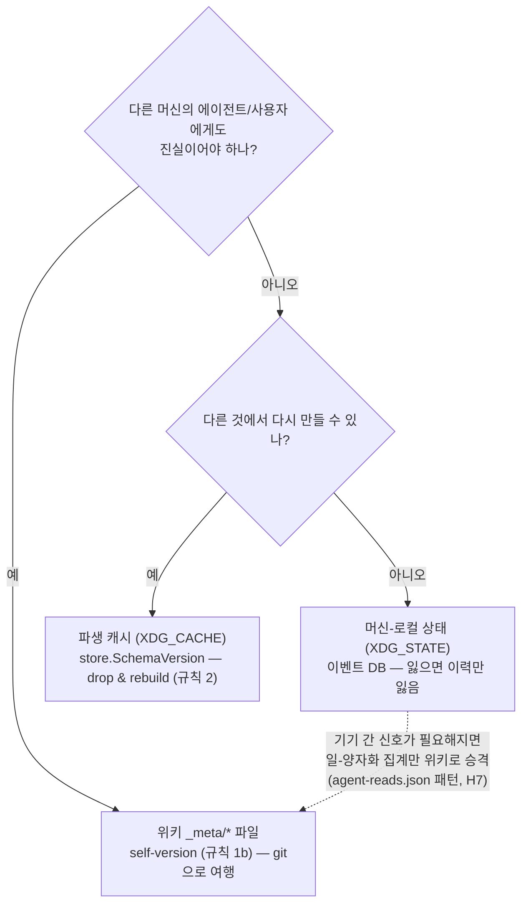

# 이벤트 로그 일반화 — 머신-로컬 sqlite의 조력

> 상태: 구현 (2026-08-03). 불변식: [invariants.md](invariants.md) **N 섹션**.
> 전제: canopy는 항상 에이전트와 **같은 호스트**에 있다 (CLI는 로컬 워크스페이스
> 필수). 이 co-location이 제약이 아니라 자산이다 — 에이전트가 서버 없이 로컬
> DB를 동기 조회할 수 있다.

## 1. 세 층과 배치 판정

canopy의 데이터는 세 층에 산다. 새 메타 정보가 생기면 이 판정을 따른다:



이벤트 DB(`$XDG_STATE_HOME/canopy/attention/*.db`)는 원래 주의(attention) 이벤트
전용이었다. 스키마 `(ts, slug, door, kind, meta)`는 이미 일반적이므로, 일반화는
스키마 변경이 아니라 **어휘·규율·조회 표면**의 확장이다. (스키마 불변 → 사다리
rung 불필요.)

## 2. kind 어휘

| 도메인 | kind | 뜻 | meta |
|---|---|---|---|
| 주의 (레거시, 무점) | `show` `recall` `view` `read` `reread` `search` | 기존 그대로 | 검색은 질의문 |
| 태스크 | `task.filed` | 태스크 접수 | task id |
| | `task.done` / `task.dismissed` | 닫힘 | task id |
| | `task.verify_rejected` | done 시도가 Verifier에 거부됨 — **태스크 파일엔 안 남는 유일한 신호** | task id: 사유 |
| | `task.gc` | 닫힌 태스크 정리 | 삭제 수 |
| 동기화 | `sync.done` | sync 완료 | committed/pushed 여부 |
| 정규화 | `reconcile.bless` | 뒷길 변경 수용 | rel path (일괄이면 `all:N`) |

**명명 규칙**: 라이프사이클 kind는 `도메인.동작`(점 포함), 주의 kind는 무점
(역사적 — 이미 쌓인 행을 개명하지 않는다, append-only). 점 유무가 곧 도메인
판별자다: 계기판 필터가 이걸 쓴다(아래 규율 3).

## 3. 세 가지 규율

1. **비권위**: 이벤트는 관측이지 진실이 아니다. 위키 정합성에 영향 주는 결정은
   이벤트를 읽지 않는다 — 소비자는 계기판(digest·status·history·향후 co-access
   후보)뿐. 따라서 **DB를 지워도 canopy의 모든 판단·상태가 보존된다** (N1).
   위키에 이미 진실이 있는 것(쓰기 로그 `logs/*.jsonl`, 태스크 파일)은 복사하지
   않고 **포인터(id·경로)만** meta에 싣는다. **[협약]**
2. **best-effort**: 기록 실패는 원 작업을 절대 깨지 않는다 (N2).
3. **도메인 분리**: 라이프사이클 이벤트는 주의 계기판(오늘의 주의, /history,
   top_consumed, sparkline)을 오염시키지 않는다 (N3). `task.filed`는 소비가
   아니다 — 무점 필터로 배제.

## 4. 조회 표면

```bash
canopy events [--kind task.*] [--slug s] [--since 7d] [-n 200] --json
canopy events gc [--days 365]     # 오래된 이벤트 정리 (머신-로컬만, 위키 무접촉)
```

에이전트는 이걸로 "지난주 이 위키에서 무슨 일이 있었나"를 한 호출로 얻는다.
`--kind`는 정확 일치 또는 `접두사*`. 보존 정책은 수동 gc(기본 365일) — 집계가
필요한 신호는 위키 승격분(agent-reads)이 이미 들고 있으므로 원본 이벤트는
유한 보존으로 충분하다.

## 5. 하지 않은 것

- **세션 축**: 프로세스 지문·시간 클러스터링으로 가능하지만 가치 대비 복잡
  (2026-08-03 판단). 이벤트가 쌓인 뒤 파생 층(캐시)으로 언제든 붙일 수 있다 —
  그래서 지금 안 해도 잃는 게 없다.
- **digest 루프 건강 리포트**: `task.*` 이벤트 위에서 "edit 평균 체류 N일,
  verify 거부 M회" — 데이터가 쌓이면 후속.
- **쓰기 이벤트**(`write.*`): `logs/*.jsonl`이 위키 진실 — 복사 금지 규율에 따라
  제외. 통합 타임라인이 필요해지면 조회 시점에 두 소스를 합친다.
