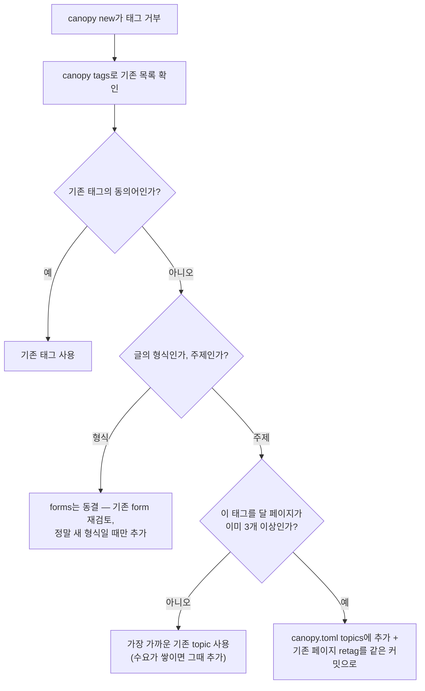

# 태그 taxonomy 거버넌스

> 설계 기록. 점검 항목은 [invariants.md](invariants.md) **S 섹션**, 에이전트 절차는
> canopy-wiki 스킬에 있다.

## 문제

taxonomy는 방치하면 양방향으로 병든다. 실측(2026-08, 181페이지 시점):

- **산만한 증가**: 40개 태그 중 11개가 사용 0회. 초기 taxonomy를 수요가 아니라
  "있을 법한 주제" 예상으로 채웠고, 회수 메커니즘이 없었다.
- **필요할 때 안 늘어남**: tool 44% · ai-ml 42% · infrastructure 38% — 페이지
  절반에 붙는 태그는 분별력이 없는데 쪼개라는 압력이 없다. `canopy new`가
  taxonomy 밖 태그를 거부하면, 에이전트의 최저항 경로는 canopy.toml 확장이
  아니라 "그나마 비슷한" 기존 태그라서 비대화가 가속된다.

## 두 facet: 주제(topic)와 형식(form)

태그는 서로 성질이 다른 두 종류가 한 목록에 섞여 있었다. 선명하게 분리한다.

| facet | 무엇 | 예 | 성질 | 증감 규칙 |
|---|---|---|---|---|
| **topic** | 페이지가 *무엇에 관한가* | ai-ml, cooking, hardware | 열린 집합 — 관심사를 따라 자란다 | 아래 3룰 (수요·분할·회수) |
| **form** | 페이지가 *어떤 종류의 글인가* | method, review, timeline | 닫힌 집합 — 글의 형식은 거의 안 는다 | 사실상 동결. 비대해 보여도 형식의 본성이므로 압력 없음 |

canopy.toml은 `topics`/`forms` 두 목록으로 선언한다. 검증(new/lint)은 합집합에
대해 동작하고, 거버넌스 룰은 topic에만 적용된다. 구형식 단일 `tags` 목록은
관용적으로 읽되(합집합 취급) audit가 분리 이행을 권고한다 — canopy.toml은
위키와 함께 여행하는 파일이므로 사다리가 아니라 관용 읽기로 진화한다
(AGENTS.md 규칙 1b).

## topic 3룰 — "taxonomy는 실측 사용의 반영이지 희망사항 목록이 아니다"

1. **추가는 수요 증명 후**: 새 topic은 그 태그를 달 페이지가 **이미 3개 이상**
   있을 때만 추가하고, 추가하는 커밋에서 기존 페이지 retag까지 함께 한다.
   "앞으로 쓸 것 같은" 태그는 추가하지 않는다. **[협약]** — 사후엔 S3(사용 ≥ 1)이
   하한을 지킨다.
2. **비대하면 분할 압력**: 한 topic이 전체 페이지의 `broad_topic_pct`%(기본 25)를
   넘으면 audit가 지목한다(S4). 어떻게 쪼갤지는 LLM 판단 — 실사용 군집을 보고
   하위 topic을 만들고 retag한다. 문턱은 위키별로 canopy.toml에서 조정(0이면 끔).
3. **사용 0이면 회수**: audit가 0회 topic을 제거 후보로 나열한다(S3). 제거는
   확인 후 canopy.toml에서 빼면 된다 — 페이지를 건드리지 않으므로 안전하다.

새 태그가 거부당했을 때의 판단 순서:

## 역할 분담 (philosophy: 판단은 LLM이, 불변식은 코드가)

- **코드**: 합집합 밖 태그 거부(new), invalid-tag 검출(lint), 사용 분포·0회
  topic·비대 topic 실측(`canopy tags --audit`).
- **LLM**: 동의어 판정, 수요 판단, 비대 topic의 분할 설계, 회수 확정.

audit는 보고만 한다(exit 0) — E6·K5와 같은 규율로 흔적도 남기지 않는다.
불변식 점검은 `--json` 출력에 jq로 한다(invariants S).
